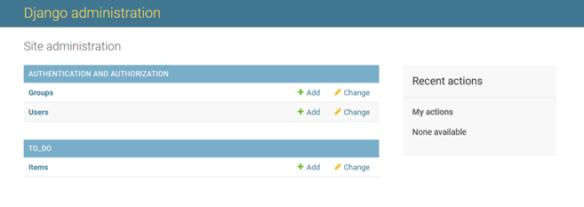

# Django Lessons

### Lesson 1 - Getting set up
1. Install Django using CLI
> pip3 install django

To check version of python:
> python[tab]

To check installed packages:
> 1. cd /workspace/.pip-modules/lib/python3.8/site-packages/
> 2. ls -la

To get back to previous directory:
> cd -

To start a project:
> django-admin startproject {project_name} .

Period at the end to signify we want project in current directory 
May need to reorder files/folders

To run locally:
> python3 manage.py runserver

### Lesson 2 - URLs

Creating an app:
> python3 manage.py startapp {app_name}

In views.py add in a test function:
> def say_hello(request): 
>    return HttpResponse("Hello!")

In urls.py:
1.  import the test function with other imports:
    > from to_do.views import say_hello

2. add a new path function in url patterns:
    > path('hello/', say_hello, name='hello')

3. To test it's working, navigate to the locally hosted server, and add /hello to the end of the url

### Lesson 3 - Templates

1. In the app folder which we created in Lesson 2, create a new folder called 'templates'
2. Inside of the 'templates' folder, create another folder called '{app_name}' from Lesson 2 (in this case 'to_do')
3. Inside that folder, create a file called '{app_name}_list.html' (in this case to_do_list.html)
4. Add boilerplate to this HTML file (type '!' and press enter)
5. Test file by adding some valid HTML within the body

In views.py:
1. Remove the return statement from the say_hello function
2. Replace with:
> return render(request, 'to_do/to_do_list.html')
3. Rename function to something more applicable if necessary
4. Remove unused HttpResponse import

In urls.py:
1. Remore the 'hello/' url path and replace with an empty string
2. Update function name and name parameter
3. Update imports to match function name

In settings.py:
1. In the INSTALLED_APPS section, add the new app 'to_do' under the other pre-installed apps

Test the locally hosted server to see if template has rendered.

### Lesson 4 - Migrations and Admin

THREE KEY COMMANDS (text in [] is optional):
1. python3 manage.py makemigrations [--dry-run]
2. python3 manage.py showmigrations
3. python3 manage.py migrate [--plan]

To create a super user:
> python3 manage.py createsuperuser

1. Run the local server again and put /admin at the end of the URL (/admin as this is stipulated in the urls.py)
2. Log in with credentials you just created

### Lesson 5 - Models

1. Add a class to models.py (see models.py for code)

When Django sees that we've created a new item class it will automatically create an items table when we make and run the database migrations.

Carry out migrations:
1. python3 manage.py makemigrations --dry-run
2. python3 manage.py makemigrations
3. python3 manage.py migrate --plan
4. python3 manage.py migrate

Register our new model in the admin.py file:

1. First, Import class from models.py
> from .models import Item

2. Then, register the model:
> admin.site.register(Item)

3. Run the project on the local server, go to the /admin page and the 'Items' table should be there 

To create a new item:
1. Click on 'Items' on the admin page
2. Click 'add item'
3. Fill out the form

To update the Item name (see models.py for extra code within the class to override django.db settings)

### Lesson 6 - Rendering Data

The next thing we need is the way to display the to our users.
So we need to find a way to get those items from the database into a template.
Remember that in the Model View template design pattern
The views represent the programming logic that allows users to interact with
the database through the templates that they see.

In views.py:
To access the Item model in this file: 
> from .models import Item

Will allow us to use the Item model in our views

To get all items in the database, add this code to the function def:
> items = Item.objects.all()

Add a a variable called context within the function def, which is just going to be a
dictionary with all of our items in it (see views.py for code).
It needs a key of items. And that value is going to be our items variable that we just created.
Add that 'context' variable as a third argument to the render function.
This will ensure that we have access to it in our todo list .html template.

#### <strong>Once we save this we've got everything we need to ensure complete communication.</strong>
#### <strong>Between the users of our app on the front end. And our database on the back end.</strong>

To test:
1. > python3 manage.py runserver

2. Open the template file (in this case to_do/templates/to_do_list.html)

3. Add the code {{ items }} to body of page

should return something like this: "<QuerySet [<Item: Create Item class>, <Item: Register Item model>]>"

4. To make more user friendly, add the for loop syntax to iterate through the items list (see html for code)

### Lesson 7 - Creating a new item

Make a copy of the to_do_list.html file and rename to something appropriate (in this case - add_item.html)

To have the new page accessible, need to add in 3 places:
1. views.py as a function def
2. urls.py as an import (update the 'from to_do.views' import)
3. urls.py as a new path

<strong>See add_item.html for code to create form and add item</strong>

Just inside the opening form tag whenever we're posting information in Django.
We need to add the CSRF or cross-site request forgery token .
This token is a randomly generated unique value which will be added
to the form as a hidden input field when the forms submitted.
And works to guarantee that the data we're posting is actually coming from our
todo list app and not from another website.

To be able to submit the form via a POST request, we need to add an if statement to the page function in views.py and add the redirect import at the top of the page

